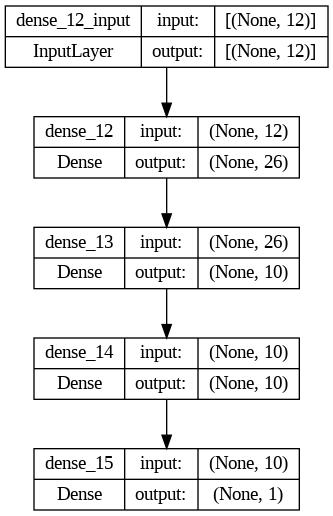
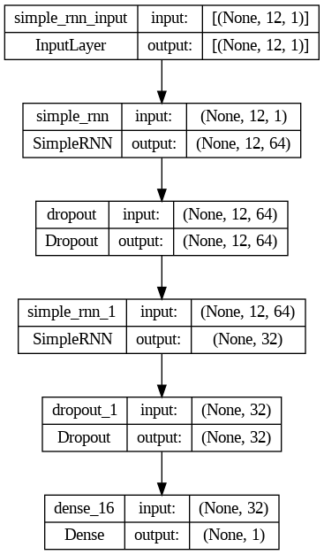
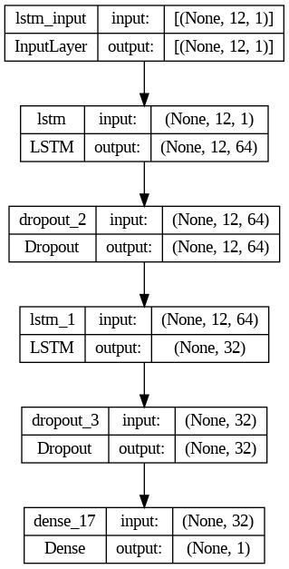

# Predictive Maintenance

## Table of Content
  * [Demo](#demo)
  * [Synopsis](#synopsis)
  * [Appendix](#appendix)
  * [Links](#links)
  * [Directory Tree](#directory_tree)
  * [Deep Learning Model Structure](#deep_learning_structure)
  * [Features](#features)
  * [Run Locally](#run_locally)
  * [License](#license)
  * [Technology Used](#technology_used)

## Demo


## Synopsis

Predictive Maintenance have been done on the NASA turbofan engine dataset to predict the Remaining useful life of the engine based upon the input from several sensors, several machine learnings models have been used to predict the RUL of the engine, and the best model which have performed well on the training data have been selected for hyperparameter tuning to increase the accuracy of the model, and finally the pre-trained model have been used for the web application to predict the real world data from the user.

So based on the given data,
#### Independent variable (X) : All the sensor values
#### Dependent variable (Y) : Remaining useful life (RUL)

Based on the given data we can identify this as a regression problem, so we can use various machine learning problems to solve this problems which are as follows:

   * Linear regression
   * Lasso regression
   * Ridge regression
   * Decision tree regressor
   * Random forest regressor
   * Gradient boost 
   * Support Vector regressor
   * Artificial Neural Network
   * Recurrent Neural Network
   * Long short term memory

I have declared this problem with random forest regression, since other models doesn't gave much accuracy.

Machine learning model : Random forest regressor (sklearn)

Data preprocessing : Pandas

Data visualization : Matplotlib, Seaborn

Web framework : Streamlit

Model deployment : Streamlit server

## Appendix

The requirement for developing this model is present in the [requirements.txt](https://github.com/Vedakeerthi/Predictive_Maintenance/blob/main/requirements.txt) file.

The development of the model is present in the [main.ipynb](https://github.com/Vedakeerthi/Predictive_Maintenance/blob/main/main.ipynb) file.

The streamlit framework for the web app development is made in the [app.py](https://github.com/Vedakeerthi/Predictive_Maintenance/blob/main/app.py) file.

## Links

 - #### Dataset link : https://www.kaggle.com/c/predictive-maintenance/data
 - #### Github link : https://github.com/Vedakeerthi/Predictive_Maintenance
 - #### Web Application link : https://vedakeerthi-predictive-maintenance-app-zuy0jx.streamlit.app/
 
## Directory Tree <a name='directory_tree'></a>

```
├── LICENSE
├── README.md
├── ann.png
├── ann2.png
├── ann_architecture.png
├── app.py
|── lstm.png
├── main.ipynb
|── model_result.gif
├── requirements.txt
|── rnn.png
├── y_pred.csv
```
 
## Deep Learning Model Structure <a name='deep_learning_structure'></a>

| Model                   | Structure                                                            |
| ------------------------| ---------------------------------------------------------------------|
| ANN  |  |
| RNN  |  |
| LSTM | |


## Features

- Live prediction analysis.
- Fullscreen mode supports in mobile, pc.
- Cross platform can be used on multiple operating system.


## Run Locally <a name='run_locally'></a>

Clone the project

```bash
  git clone https://github.com/Vedakeerthi/Predictive_Maintenance.git
```

Install dependencies

```bash
  pip install -r requirements.txt
```

Start the server

```bash
  streamlit run app.py
```

Run the app on server by the local link provided


## License

[](https://github.com/Vedakeerthi/Predictive_Maintenance/blob/main/LICENSE)

## Technology Used <a name='technology_used'></a>

<a href="https://www.python.org" target="_blank" rel="noreferrer">  </a> &nbsp;
<a href="https://scikit-learn.org/" target="_blank" rel="noreferrer">  </a> &nbsp;
<a href="https://www.tensorflow.org/" target="_blank" rel="noreferrer">  </a> &nbsp;
<a href="https://matplotlib.org/" target="_blank" rel="noreferrer">  </a> &nbsp;
<a href="https://seaborn.pydata.org/" target="_blank" rel="noreferrer">  </a> &nbsp;
<a href="https://pypi.org/project/streamlit/" target="_blank" rel="noreferrer"> </a> &nbsp;
